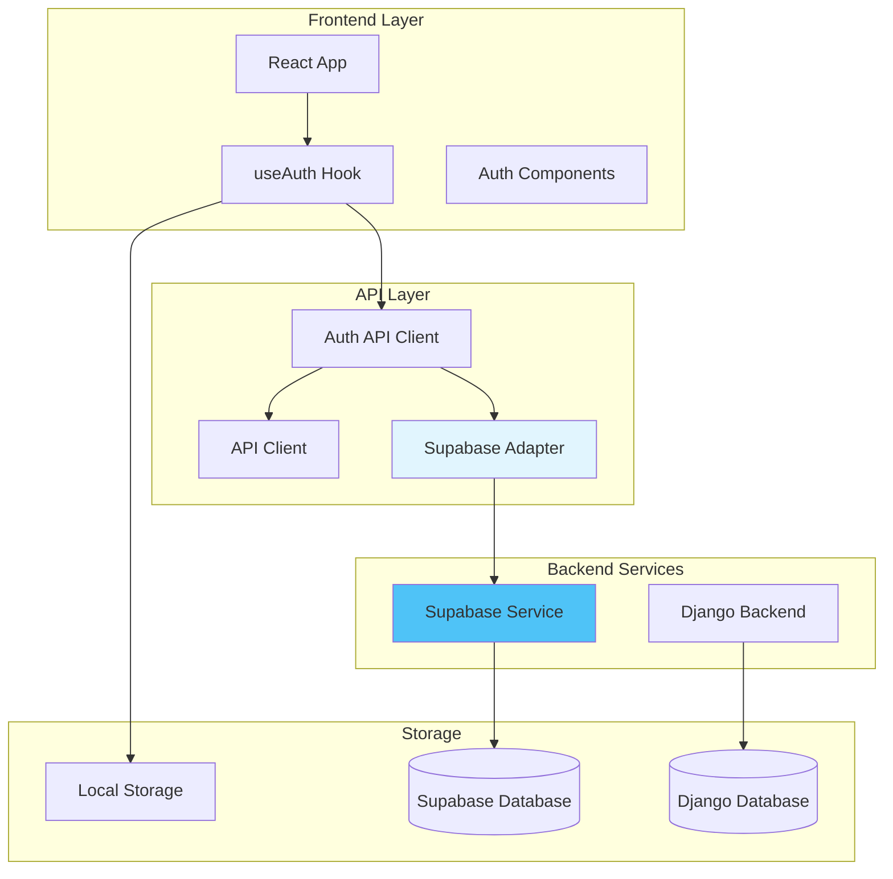
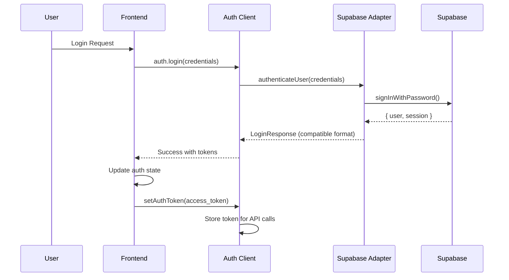
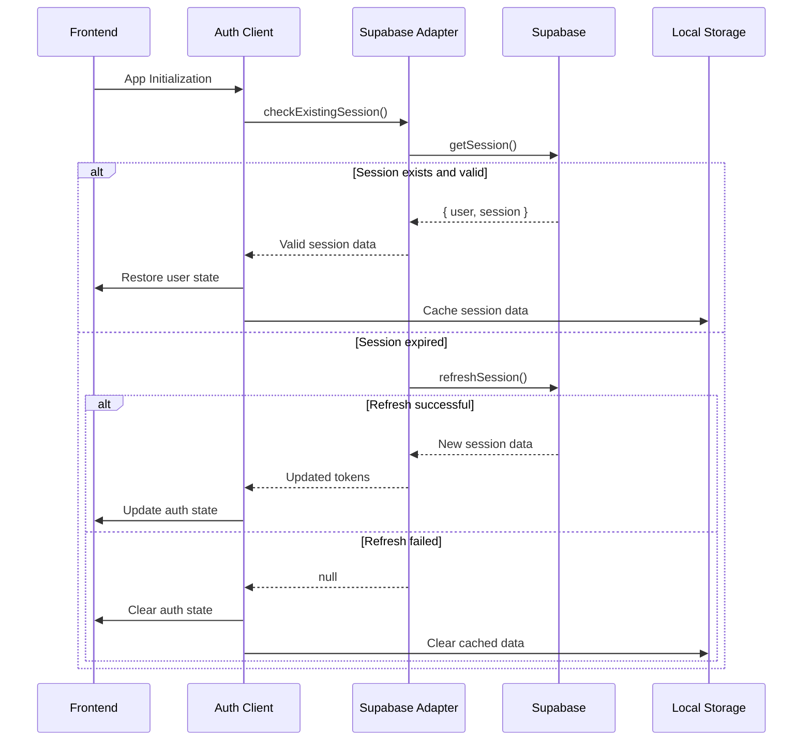

# Design Document - Supabase Authentication Integration

## Overview

This design document outlines the integration of Supabase as the authentication backend service for the Agentic Workflow application. The integration will replace the current Django-based authentication while maintaining complete compatibility with the existing React frontend and TypeScript API layer.

The design focuses on creating a seamless transition that preserves all existing interfaces, data structures, and user experience while leveraging Supabase's powerful authentication features including social logins, email verification, session management, and automatic token refresh.

## Architecture

### System Architecture



### Authentication Flow



### Session Management Flow



## Components and Interfaces

### Supabase Adapter Component

The core component that translates between Supabase APIs and our existing interfaces:

```typescript
interface SupabaseAdapter {
  // Authentication methods
  authenticateUser(credentials: LoginRequest): Promise<LoginResponse>;
  registerUser(userData: RegisterRequest): Promise<RegisterResponse>;
  signOut(): Promise<void>;
  
  // Session management
  getActiveSession(): Promise<SupabaseSession | null>;
  refreshSession(): Promise<RefreshTokenResponse>;
  
  // Profile management  
  getUserProfile(): Promise<ProfileResponse>;
  updateUserProfile(data: UpdateProfileRequest): Promise<ProfileResponse>;
  
  // Password management
  resetPassword(email: string): Promise<void>;
  updatePassword(newPassword: string): Promise<void>;
  
  // Email verification
  verifyEmail(token: string): Promise<void>;
  resendVerificationEmail(): Promise<void>;
}
```

### Enhanced Auth API Client

Extension of the existing AuthApiClient to work with the Supabase adapter:

```typescript
export class AuthApiClient {
  private supabaseAdapter: SupabaseAdapter;
  
  constructor(
    private apiClient: ApiClient,
    private supabaseConfig: SupabaseConfig
  ) {
    this.supabaseAdapter = new SupabaseAdapter(supabaseConfig);
  }
  
  // Existing interface methods maintained
  async login(credentials: LoginRequest): Promise<ApiResponse<LoginResponse>>;
  async register(userData: RegisterRequest): Promise<ApiResponse<RegisterResponse>>;
  async logout(): Promise<ApiResponse<void>>;
  async refreshToken(refreshData: RefreshTokenRequest): Promise<ApiResponse<RefreshTokenResponse>>;
  async getProfile(): Promise<ApiResponse<ProfileResponse>>;
  async updateProfile(profileData: UpdateProfileRequest): Promise<ApiResponse<ProfileResponse>>;
  
  // Extended methods for Supabase features
  async changePassword(passwordData: ChangePasswordRequest): Promise<ApiResponse<void>>;
  async forgotPassword(email: string): Promise<ApiResponse<void>>;
  async resetPassword(token: string, newPassword: string): Promise<ApiResponse<void>>;
  async verifyEmail(token: string): Promise<ApiResponse<void>>;
  async resendVerificationEmail(): Promise<ApiResponse<void>>;
}
```

### Session Manager

Handles automatic token refresh and session persistence:

```typescript
interface SessionManager {
  startSessionMonitoring(): void;
  stopSessionMonitoring(): void;
  scheduleTokenRefresh(expiresIn: number): void;
  clearScheduledRefresh(): void;
  persistSession(session: SessionData): void;
  restoreSession(): SessionData | null;
  clearSession(): void;
}
```

### Configuration Interface

```typescript
interface SupabaseConfig {
  url: string;
  anonKey: string;
  options?: {
    db?: {
      schema?: string;
    };
    auth?: {
      autoRefreshToken?: boolean;
      persistSession?: boolean;
      detectSessionInUrl?: boolean;
    };
  };
}
```

## Data Models

### Authentication Data Structures

The existing data models will be preserved to maintain compatibility:

```typescript
// Existing interfaces maintained exactly as-is
interface LoginRequest {
  email: string;
  password: string;
}

interface LoginResponse {
  access_token: string;
  refresh_token: string;
  expires_in: number;
  user: {
    id: string;
    email: string;
    name: string;
    created_at: string;
    updated_at: string;
  };
}

interface RegisterRequest {
  email: string;
  password: string;
  name: string;
}

interface ProfileResponse {
  id: string;
  email: string;
  name: string;
  created_at: string;
  updated_at: string;
}
```

### Supabase Mapping

Internal mapping between Supabase and application data models:

```typescript
// Internal Supabase session data
interface SupabaseSession {
  access_token: string;
  refresh_token: string;
  expires_in: number;
  user: SupabaseUser;
}

interface SupabaseUser {
  id: string;
  email: string;
  user_metadata: {
    name?: string;
  };
  created_at: string;
  updated_at: string;
}

// Mapping functions
function mapSupabaseUserToProfile(supabaseUser: SupabaseUser): ProfileResponse {
  return {
    id: supabaseUser.id,
    email: supabaseUser.email,
    name: supabaseUser.user_metadata.name || '',
    created_at: supabaseUser.created_at,
    updated_at: supabaseUser.updated_at,
  };
}

function mapSupabaseSessionToLogin(session: SupabaseSession): LoginResponse {
  return {
    access_token: session.access_token,
    refresh_token: session.refresh_token,
    expires_in: session.expires_in,
    user: mapSupabaseUserToProfile(session.user),
  };
}
```

### Session Storage Schema

```typescript
interface StoredSessionData {
  access_token: string;
  refresh_token: string;
  expires_at: number;
  user: ProfileResponse;
  last_refreshed: number;
}
```

## Error Handling

### Error Classification

```typescript
enum AuthErrorTypes {
  INVALID_CREDENTIALS = 'invalid_credentials',
  NETWORK_ERROR = 'network_error',
  SESSION_EXPIRED = 'session_expired',
  EMAIL_NOT_VERIFIED = 'email_not_verified',
  USER_NOT_FOUND = 'user_not_found',
  EMAIL_ALREADY_EXISTS = 'email_already_exists',
  WEAK_PASSWORD = 'weak_password',
  RATE_LIMIT_EXCEEDED = 'rate_limit_exceeded',
  SUPABASE_SERVICE_ERROR = 'supabase_service_error',
}
```

### Error Mapping Strategy

```typescript
interface ErrorMapper {
  mapSupabaseError(error: AuthError): ApiError;
  mapNetworkError(error: Error): ApiError;
  mapValidationError(error: ValidationError): ApiError;
}

class SupabaseErrorMapper implements ErrorMapper {
  mapSupabaseError(error: AuthError): ApiError {
    const errorMap: Record<string, { message: string; code: string }> = {
      'invalid_credentials': {
        message: 'Invalid email or password',
        code: 'INVALID_CREDENTIALS'
      },
      'signup_disabled': {
        message: 'User registration is currently disabled',
        code: 'SIGNUP_DISABLED'
      },
      'email_address_invalid': {
        message: 'Please enter a valid email address',
        code: 'INVALID_EMAIL'
      },
      'password_too_short': {
        message: 'Password must be at least 8 characters long',
        code: 'WEAK_PASSWORD'
      },
      'user_not_found': {
        message: 'No account found with this email address',
        code: 'USER_NOT_FOUND'
      },
      'email_not_confirmed': {
        message: 'Please verify your email address before logging in',
        code: 'EMAIL_NOT_VERIFIED'
      }
    };
    
    const mapped = errorMap[error.message] || {
      message: 'An authentication error occurred',
      code: 'AUTH_ERROR'
    };
    
    return {
      message: mapped.message,
      code: mapped.code,
      details: { supabaseError: error.message }
    };
  }
}
```

### Retry and Fallback Logic

```typescript
interface RetryConfig {
  maxAttempts: number;
  baseDelay: number;
  maxDelay: number;
  backoffMultiplier: number;
}

class AuthRetryHandler {
  async executeWithRetry<T>(
    operation: () => Promise<T>,
    config: RetryConfig
  ): Promise<T> {
    let lastError: Error;
    
    for (let attempt = 1; attempt <= config.maxAttempts; attempt++) {
      try {
        return await operation();
      } catch (error) {
        lastError = error as Error;
        
        if (attempt === config.maxAttempts) {
          throw lastError;
        }
        
        const delay = Math.min(
          config.baseDelay * Math.pow(config.backoffMultiplier, attempt - 1),
          config.maxDelay
        );
        
        await new Promise(resolve => setTimeout(resolve, delay));
      }
    }
    
    throw lastError;
  }
}
```

## Testing Strategy

### Unit Testing Approach

1. **Supabase Adapter Testing**
   - Mock Supabase client responses
   - Test data transformation functions
   - Verify error handling and mapping
   - Test session management logic

2. **Auth API Client Testing**
   - Test integration with Supabase adapter
   - Verify interface compatibility
   - Test error propagation
   - Mock network conditions

3. **Session Manager Testing**
   - Test automatic refresh logic  
   - Verify persistence mechanisms
   - Test cleanup procedures
   - Mock timer functions

### Integration Testing

1. **End-to-End Authentication Flow**
   - Complete login/logout cycles
   - Registration with email verification
   - Password reset workflows
   - Session restoration scenarios

2. **Error Scenario Testing**
   - Network failure handling
   - Supabase service unavailability
   - Token expiration edge cases
   - Concurrent session handling

### Test Environment Setup

```typescript
// Test configuration
const testSupabaseConfig: SupabaseConfig = {
  url: 'https://test-project.supabase.co',
  anonKey: 'test-anon-key',
  options: {
    auth: {
      autoRefreshToken: false, // Disable for controlled testing
      persistSession: false,   // Avoid test pollution
    }
  }
};

// Mock factories
class MockSupabaseClient {
  auth = {
    signInWithPassword: jest.fn(),
    signUp: jest.fn(),
    signOut: jest.fn(),
    getSession: jest.fn(),
    refreshSession: jest.fn(),
    updateUser: jest.fn(),
    resetPasswordForEmail: jest.fn(),
  };
}
```

### Performance Testing

1. **Authentication Response Times**
   - Login operations < 2 seconds
   - Token refresh < 1 second
   - Session restoration < 1 second

2. **Memory and Resource Usage**
   - Session data caching efficiency
   - Timer cleanup verification
   - Memory leak detection

3. **Concurrent User Simulation**
   - Multiple simultaneous auth operations
   - Session conflict resolution
   - Rate limiting behavior

## Security Considerations

### Token Management

1. **Access Token Security**
   - Short expiration times (1 hour recommended)
   - Secure transmission via HTTPS only
   - No storage in local storage (memory only)
   - Automatic cleanup on logout

2. **Refresh Token Security**
   - Secure storage in httpOnly cookies when possible
   - Automatic rotation on refresh
   - Immediate invalidation on logout
   - Protection against XSS attacks

### Environment Configuration

```typescript
interface SecureConfig {
  supabase: {
    url: string;              // From SUPABASE_URL
    anonKey: string;         // From SUPABASE_ANON_KEY  
    serviceRoleKey?: string; // From SUPABASE_SERVICE_ROLE_KEY (backend only)
  };
  security: {
    tokenExpiration: number;
    refreshThreshold: number;
    maxLoginAttempts: number;
    rateLimitWindow: number;
  };
}
```

### Data Validation

```typescript
class AuthValidationService {
  validateLoginRequest(data: LoginRequest): ValidationResult {
    const errors: string[] = [];
    
    if (!this.isValidEmail(data.email)) {
      errors.push('Please enter a valid email address');
    }
    
    if (!data.password || data.password.length < 8) {
      errors.push('Password must be at least 8 characters long');
    }
    
    return { isValid: errors.length === 0, errors };
  }
  
  validateRegistrationRequest(data: RegisterRequest): ValidationResult {
    const errors: string[] = [];
    
    // Email validation
    if (!this.isValidEmail(data.email)) {
      errors.push('Please enter a valid email address');
    }
    
    // Password strength validation
    if (!this.isStrongPassword(data.password)) {
      errors.push('Password must contain at least 8 characters, including uppercase, lowercase, and numbers');
    }
    
    // Name validation
    if (!data.name || data.name.trim().length < 2) {
      errors.push('Name must be at least 2 characters long');
    }
    
    return { isValid: errors.length === 0, errors };
  }
}
```

## Migration Strategy

### Phase 1: Infrastructure Setup
- Set up Supabase project and configuration
- Create environment variables and secure key management
- Implement Supabase adapter with data transformation

### Phase 2: Backend Integration
- Develop AuthApiClient extensions
- Implement session management layer
- Create comprehensive error handling

### Phase 3: Frontend Integration
- Update useAuth hook to work with new backend
- Ensure UI components remain unchanged
- Implement session restoration logic

### Phase 4: Testing and Validation
- Execute comprehensive test suite
- Perform security audits
- Validate performance requirements

### Phase 5: Deployment and Monitoring
- Deploy with feature flags for gradual rollout
- Monitor authentication metrics
- Implement rollback procedures if needed

## Performance Optimization

### Caching Strategy

1. **Session Data Caching**
   - Cache user profile data in memory
   - Implement cache invalidation on profile updates
   - Use efficient data structures for quick lookups

2. **Token Refresh Optimization**
   - Preemptive token refresh before expiration
   - Queue concurrent refresh requests
   - Implement refresh jitter to avoid thundering herd

### Network Optimization

1. **Request Batching**
   - Combine profile updates with authentication
   - Batch multiple session operations
   - Implement request deduplication

2. **Connection Management**
   - Reuse Supabase client connections
   - Implement connection pooling for high load
   - Handle network timeout gracefully

## Monitoring and Analytics

### Authentication Metrics

```typescript
interface AuthMetrics {
  loginAttempts: number;
  loginSuccesses: number;
  loginFailures: number;
  registrationAttempts: number;
  registrationSuccesses: number;
  tokenRefreshes: number;
  sessionRestorations: number;
  averageResponseTime: number;
}
```

### Error Tracking

```typescript
interface ErrorTracking {
  supabaseErrors: Record<string, number>;
  networkErrors: number;
  validationErrors: Record<string, number>;
  timeoutErrors: number;
  rateLimitErrors: number;
}
```

## Configuration Management

### Environment Variables

```bash
# Required Supabase configuration
SUPABASE_URL=https://your-project.supabase.co
SUPABASE_ANON_KEY=your-anon-key

# Optional configuration
SUPABASE_SERVICE_ROLE_KEY=your-service-role-key
AUTH_TOKEN_EXPIRATION=3600
AUTH_REFRESH_THRESHOLD=300
AUTH_MAX_LOGIN_ATTEMPTS=5
AUTH_RATE_LIMIT_WINDOW=300
```

### Runtime Configuration

```typescript
class ConfigurationManager {
  private config: SecureConfig;
  
  constructor() {
    this.config = this.loadConfiguration();
    this.validateConfiguration();
  }
  
  private loadConfiguration(): SecureConfig {
    return {
      supabase: {
        url: this.getRequiredEnvVar('SUPABASE_URL'),
        anonKey: this.getRequiredEnvVar('SUPABASE_ANON_KEY'),
        serviceRoleKey: process.env.SUPABASE_SERVICE_ROLE_KEY,
      },
      security: {
        tokenExpiration: parseInt(process.env.AUTH_TOKEN_EXPIRATION || '3600'),
        refreshThreshold: parseInt(process.env.AUTH_REFRESH_THRESHOLD || '300'),
        maxLoginAttempts: parseInt(process.env.AUTH_MAX_LOGIN_ATTEMPTS || '5'),
        rateLimitWindow: parseInt(process.env.AUTH_RATE_LIMIT_WINDOW || '300'),
      }
    };
  }
  
  private validateConfiguration(): void {
    if (!this.config.supabase.url.includes('supabase.co')) {
      throw new Error('Invalid Supabase URL configuration');
    }
    
    if (this.config.supabase.anonKey.length < 32) {
      throw new Error('Invalid Supabase anon key configuration');
    }
  }
}
```

This design provides a comprehensive foundation for integrating Supabase authentication while maintaining complete compatibility with the existing system architecture and user interface.