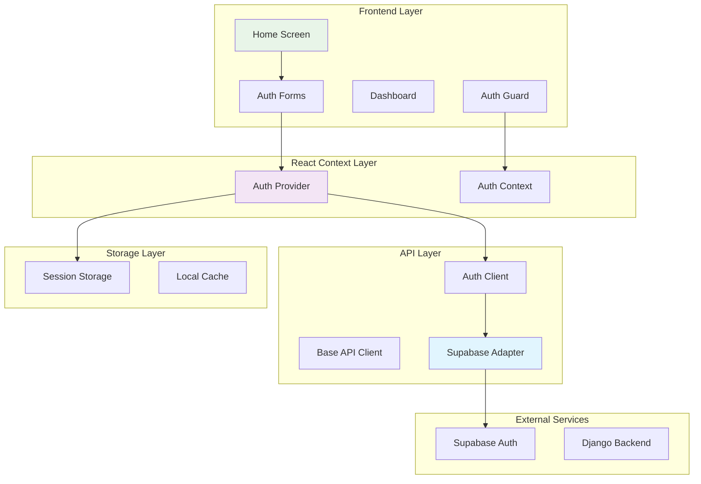
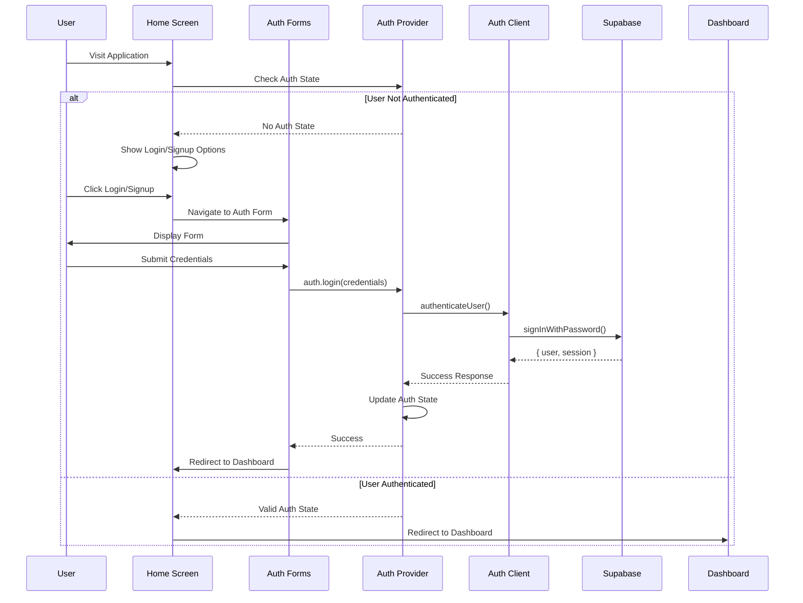
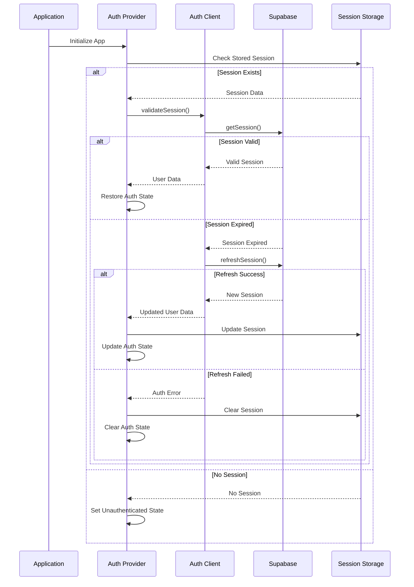

# Design Document - User Authentication Feature

## Overview

This design document outlines the implementation of comprehensive user authentication functionality for the Agentic Workflow application. The system will feature a home screen that prompts users to signup and login, leveraging Supabase Auth as the backend service while maintaining seamless integration with the existing React frontend and TypeScript API architecture.

The design prioritizes extensibility for future authentication methods (Google login, 2FA, biometric authentication) while providing a secure, accessible, and performant user experience that follows the existing monorepo patterns and shared component library.

## Architecture

### High-Level System Architecture



### Authentication Flow Architecture



### Session Management Flow



## Components and Interfaces

### Authentication Context and Provider

The core authentication state management system:

```typescript
// Auth Context Types
interface AuthUser {
  id: string;
  email: string;
  name: string;
  createdAt: string;
  updatedAt: string;
}

interface AuthState {
  user: AuthUser | null;
  isAuthenticated: boolean;
  isLoading: boolean;
  error: string | null;
}

interface AuthContextValue extends AuthState {
  login: (credentials: LoginCredentials) => Promise<void>;
  signup: (userData: SignupData) => Promise<void>;
  logout: () => Promise<void>;
  resetPassword: (email: string) => Promise<void>;
  clearError: () => void;
}

// Auth Provider Component
interface AuthProviderProps {
  children: React.ReactNode;
}

const AuthProvider: React.FC<AuthProviderProps> = ({ children }) => {
  // Implementation details in tasks
};

// Custom Hook
const useAuth = (): AuthContextValue => {
  const context = useContext(AuthContext);
  if (!context) {
    throw new Error('useAuth must be used within AuthProvider');
  }
  return context;
};
```

### Authentication Client Architecture

Building on the existing `ApiClient` pattern:

```typescript
// Extended Auth Client
interface AuthClientConfig {
  supabaseUrl: string;
  supabaseKey: string;
  apiClient: ApiClient;
}

interface LoginCredentials {
  email: string;
  password: string;
}

interface SignupData {
  email: string;
  password: string;
  name: string;
}

interface AuthResponse {
  user: AuthUser;
  tokens: {
    access_token: string;
    refresh_token: string;
    expires_in: number;
  };
}

class AuthClient {
  private supabaseAdapter: SupabaseAdapter;
  private apiClient: ApiClient;
  
  constructor(config: AuthClientConfig) {
    this.supabaseAdapter = new SupabaseAdapter({
      url: config.supabaseUrl,
      key: config.supabaseKey,
    });
    this.apiClient = config.apiClient;
  }
  
  async login(credentials: LoginCredentials): Promise<AuthResponse> {
    // Implementation details in tasks
  }
  
  async signup(userData: SignupData): Promise<AuthResponse> {
    // Implementation details in tasks
  }
  
  async logout(): Promise<void> {
    // Implementation details in tasks
  }
  
  async refreshSession(): Promise<AuthResponse> {
    // Implementation details in tasks
  }
  
  async resetPassword(email: string): Promise<void> {
    // Implementation details in tasks
  }
  
  async getCurrentUser(): Promise<AuthUser | null> {
    // Implementation details in tasks  
  }
}
# Design Document - User Authentication Feature

_For canonical implementation details and up-to-date requirements, see the `supabase-auth/design.md` and `supabase-auth/requirements.md` files. This document is the architectural and UX blueprint for the user authentication feature._
```
### Supabase Adapter

Abstraction layer for Supabase operations:

```typescript
interface SupabaseConfig {
  url: string;
  key: string;
}

interface SupabaseAuthResponse {
  data: {
    user: SupabaseUser | null;
    session: SupabaseSession | null;
  };
  error: AuthError | null;
}

class SupabaseAdapter {
  private client: SupabaseClient;
  
  constructor(config: SupabaseConfig) {
    this.client = createClient(config.url, config.key);
  }
  
  async signInWithPassword(credentials: LoginCredentials): Promise<SupabaseAuthResponse> {
    return await this.client.auth.signInWithPassword(credentials);
  }
  
  async signUp(userData: SignupData): Promise<SupabaseAuthResponse> {
    return await this.client.auth.signUp({
      email: userData.email,
      password: userData.password,
      options: {
        data: {
          name: userData.name,
        },
      },
    });
  }
  
  async signOut(): Promise<{ error: AuthError | null }> {
    return await this.client.auth.signOut();
  }
  
  async getSession(): Promise<{ data: { session: SupabaseSession | null }; error: AuthError | null }> {
    return await this.client.auth.getSession();
  }
  
  async refreshSession(): Promise<SupabaseAuthResponse> {
- Provide migration scripts and a plan for moving user data from Django to Supabase.
- Support dual-auth during migration if needed, with a clear deprecation path for Django auth.
- Ensure user IDs and session tokens are mapped or migrated to maintain user continuity.
    return await this.client.auth.refreshSession();
  }
  
  async resetPasswordForEmail(email: string): Promise<{ error: AuthError | null }> {
    return await this.client.auth.resetPasswordForEmail(email);
  }
  
  // Utility method to transform Supabase user to our AuthUser format
  transformUser(supabaseUser: SupabaseUser): AuthUser {
    return {
      id: supabaseUser.id,
      email: supabaseUser.email!,
      name: supabaseUser.user_metadata?.name || '',
      createdAt: supabaseUser.created_at,
      updatedAt: supabaseUser.updated_at || supabaseUser.created_at,
    };
  }
}
```

### UI Components Architecture

Using the existing component patterns and shared UI library:

```typescript
// Home Screen Component
interface HomeScreenProps {
  className?: string;
}

const HomeScreen: React.FC<HomeScreenProps> = ({ className }) => {
  const { isAuthenticated, isLoading } = useAuth();
  const navigate = useNavigate();
  
  // Implementation details in tasks
};

// Auth Forms Components
interface LoginFormProps {
  onSuccess?: () => void;
  onError?: (error: string) => void;
}

- Use browser `storage` events or a shared worker to synchronize session state across tabs/windows.

const LoginForm: React.FC<LoginFormProps> = ({ onSuccess, onError }) => {
  // Uses existing Input and Button components from @agentic-workflow/ui
};

interface SignupFormProps {
  onSuccess?: () => void;
  onError?: (error: string) => void;
}

const SignupForm: React.FC<SignupFormProps> = ({ onSuccess, onError }) => {
  // Uses existing Input and Button components from @agentic-workflow/ui
};

// Auth Guard Component
interface AuthGuardProps {
  children: React.ReactNode;
  fallback?: React.ReactNode;
  requireAuth?: boolean;
}

const AuthGuard: React.FC<AuthGuardProps> = ({ 
  children, 
  fallback = <HomeScreen />, 
  requireAuth = true 
}) => {
  const { isAuthenticated, isLoading } = useAuth();
  
  if (isLoading) {
    return <div>Loading...</div>; // Could use a loading component
  }
  
  if (requireAuth && !isAuthenticated) {
    return <>{fallback}</>;
  }
  
  if (!requireAuth && isAuthenticated) {
    return <Navigate to="/dashboard" replace />;
  }
  
  return <>{children}</>;
};
```

## Data Models

### Authentication Data Types

Leveraging and extending the existing shared types:

```typescript
// Extending existing shared types from @agentic-workflow/shared
export interface AuthUser extends User {
  // User interface already exists in shared types
  // We'll use it directly with potential extensions
}

- Store refresh tokens in httpOnly cookies in production; use sessionStorage only for local/dev.
- Implement rate limiting and brute-force protection on all authentication endpoints.

export interface LoginCredentials {
  email: string;
  password: string;
}

export interface SignupData {
  email: string;
  password: string;
  name: string;
}

export interface AuthTokens extends AuthTokens {
  // AuthTokens interface already exists in shared types
  // Using it directly
}

export interface AuthResponse {
  user: AuthUser;
  tokens: AuthTokens;
}

// Session storage schema
export interface StoredSession {
  user: AuthUser;
  tokens: AuthTokens;
  expiresAt: number;
  lastRefresh: number;
}
```

### Form Validation Schema

```typescript
interface ValidationRule {
  required?: boolean;
  minLength?: number;
  maxLength?: number;
  pattern?: RegExp;
  message: string;
}

interface ValidationSchema {
  [field: string]: ValidationRule[];
}

const loginValidationSchema: ValidationSchema = {
  email: [
    { required: true, message: 'Email is required' },
    { pattern: /^[^\s@]+@[^\s@]+\.[^\s@]+$/, message: 'Please enter a valid email address' },
  ],
  password: [
    { required: true, message: 'Password is required' },
    { minLength: 8, message: 'Password must be at least 8 characters long' },
  ],
};


- Integrate authentication error and metric tracking with the existing observability stack (e.g., Sentry, Datadog).
const signupValidationSchema: ValidationSchema = {
  ...loginValidationSchema,
  name: [
    { required: true, message: 'Name is required' },
    { minLength: 2, message: 'Name must be at least 2 characters long' },
    { maxLength: 50, message: 'Name must be less than 50 characters' },
  ],
  password: [
    { required: true, message: 'Password is required' },
    { minLength: 8, message: 'Password must be at least 8 characters long' },
    { 
      pattern: /^(?=.*[a-z])(?=.*[A-Z])(?=.*\d)(?=.*[@$!%*?&])[A-Za-z\d@$!%*?&]/, 
      message: 'Password must contain uppercase, lowercase, number, and special character' 
    },
  ],
};
```

## Error Handling

### Error Classification and Mapping

```typescript

- All authentication UI components will be tested for and conform to WCAG 2.1 AA standards.
enum AuthErrorTypes {
  // Authentication Errors
  INVALID_CREDENTIALS = 'invalid_credentials',
  USER_NOT_FOUND = 'user_not_found',
  EMAIL_NOT_VERIFIED = 'email_not_verified',
  
  // Registration Errors
  EMAIL_ALREADY_EXISTS = 'email_already_exists',
  WEAK_PASSWORD = 'weak_password',
  INVALID_EMAIL = 'invalid_email',
  
  // Session Errors
  SESSION_EXPIRED = 'session_expired',
  TOKEN_REFRESH_FAILED = 'token_refresh_failed',
  
  // Network Errors
  NETWORK_ERROR = 'network_error',
  TIMEOUT_ERROR = 'timeout_error',
  
  // Service Errors
  SUPABASE_ERROR = 'supabase_error',
  RATE_LIMIT_EXCEEDED = 'rate_limit_exceeded',
  
  // Validation Errors
  VALIDATION_ERROR = 'validation_error',
  
  // Unknown Errors
  UNKNOWN_ERROR = 'unknown_error',
}

interface AuthError {
  type: AuthErrorTypes;
  message: string;
  details?: Record<string, unknown>;
  timestamp?: number;
}

class AuthErrorHandler {
  static mapSupabaseError(error: any): AuthError {
    const errorMap: Record<string, AuthErrorTypes> = {
      'invalid_credentials': AuthErrorTypes.INVALID_CREDENTIALS,
      'user_not_found': AuthErrorTypes.USER_NOT_FOUND,
      'email_not_confirmed': AuthErrorTypes.EMAIL_NOT_VERIFIED,
      'signup_disabled': AuthErrorTypes.SUPABASE_ERROR,
      'email_address_invalid': AuthErrorTypes.INVALID_EMAIL,
      'password_too_short': AuthErrorTypes.WEAK_PASSWORD,
      'user_already_registered': AuthErrorTypes.EMAIL_ALREADY_EXISTS,
    };
    
    const errorType = errorMap[error.message] || AuthErrorTypes.SUPABASE_ERROR;
    
    return {
      type: errorType,
      message: this.getErrorMessage(errorType),
      details: { supabaseError: error.message },
      timestamp: Date.now(),
    };
  }
  
  static getErrorMessage(type: AuthErrorTypes): string {
    const messages: Record<AuthErrorTypes, string> = {
      [AuthErrorTypes.INVALID_CREDENTIALS]: 'Invalid email or password',
      [AuthErrorTypes.USER_NOT_FOUND]: 'No account found with this email address',
      [AuthErrorTypes.EMAIL_NOT_VERIFIED]: 'Please verify your email address before logging in',
      [AuthErrorTypes.EMAIL_ALREADY_EXISTS]: 'An account with this email already exists',
      [AuthErrorTypes.WEAK_PASSWORD]: 'Password does not meet security requirements',
      [AuthErrorTypes.INVALID_EMAIL]: 'Please enter a valid email address',
      [AuthErrorTypes.SESSION_EXPIRED]: 'Your session has expired. Please log in again',
      [AuthErrorTypes.TOKEN_REFRESH_FAILED]: 'Unable to refresh session. Please log in again',
      [AuthErrorTypes.NETWORK_ERROR]: 'Network error. Please check your connection',
      [AuthErrorTypes.TIMEOUT_ERROR]: 'Request timed out. Please try again',
      [AuthErrorTypes.SUPABASE_ERROR]: 'Authentication service error. Please try again',
      [AuthErrorTypes.RATE_LIMIT_EXCEEDED]: 'Too many attempts. Please wait before trying again',
      [AuthErrorTypes.VALIDATION_ERROR]: 'Please check your input and try again',
      [AuthErrorTypes.UNKNOWN_ERROR]: 'An unexpected error occurred. Please try again',
    };
    
    return messages[type];
  }
}
```

### Error Boundary Component

```typescript
interface AuthErrorBoundaryState {
  hasError: boolean;
  error: AuthError | null;
}

class AuthErrorBoundary extends React.Component<
  React.PropsWithChildren<{}>,
  AuthErrorBoundaryState
> {
  constructor(props: React.PropsWithChildren<{}>) {
    super(props);
    this.state = { hasError: false, error: null };
  }
  
  static getDerivedStateFromError(error: Error): AuthErrorBoundaryState {
    return {
      hasError: true,
      error: {
        type: AuthErrorTypes.UNKNOWN_ERROR,
        message: error.message,
        timestamp: Date.now(),
      },
    };
  }
  
  componentDidCatch(error: Error, errorInfo: React.ErrorInfo) {
    console.error('Auth Error Boundary caught an error:', error, errorInfo);
    // Could send to monitoring service
  }
  
  render() {
    if (this.state.hasError) {
      return (
        <div className="error-fallback">
          <h2>Authentication Error</h2>
          <p>{this.state.error?.message}</p>
          <Button onClick={() => this.setState({ hasError: false, error: null })}>
            Try Again
          </Button>
        </div>
      );
    }
    
    return this.props.children;
  }
}
```

## Testing Strategy

### Component Testing Approach

```typescript
// Example test structure for Auth Provider
describe('AuthProvider', () => {
  let mockAuthClient: jest.Mocked<AuthClient>;
  
  beforeEach(() => {
    mockAuthClient = {
      login: jest.fn(),
      signup: jest.fn(),
      logout: jest.fn(),
      getCurrentUser: jest.fn(),
      refreshSession: jest.fn(),
      resetPassword: jest.fn(),
    } as jest.Mocked<AuthClient>;
  });
  
  it('should initialize with unauthenticated state', () => {
    // Test implementation
  });
  
  it('should restore session on mount if valid session exists', async () => {
    // Test implementation
  });
  
  it('should handle login success', async () => {
    // Test implementation
  });
  
  it('should handle login failure', async () => {
    // Test implementation
  });
  
  // Additional test cases...
});

// Form testing example
describe('LoginForm', () => {
  it('should validate email format', async () => {
    // Test implementation
  });
  
  it('should validate password requirements', async () => {
    // Test implementation
  });
  
  it('should display loading state during submission', async () => {
    // Test implementation
  });
  
  it('should display error messages', async () => {
    // Test implementation
  });
});
```

### Integration Testing

```typescript
// Auth flow integration tests
describe('Authentication Flow Integration', () => {
  it('should complete full signup and login flow', async () => {
    // Test end-to-end signup and login process
  });
  
  it('should handle session restoration', async () => {
    // Test session persistence and restoration
  });
  
  it('should handle token refresh', async () => {
    // Test automatic token refresh
  });
  
  it('should handle logout and cleanup', async () => {
    // Test logout process and state cleanup
  });
});
```

### Accessibility Testing

```typescript
describe('Authentication Accessibility', () => {
  it('should have proper ARIA labels', () => {
    // Test ARIA attributes
  });
  
  it('should support keyboard navigation', () => {
    // Test keyboard accessibility
  });
  
  it('should announce errors to screen readers', () => {
    // Test screen reader support
  });
  
  it('should meet WCAG 2.1 AA standards', () => {
    // Test accessibility compliance
  });
});
```

## Security Considerations

### Token Management Strategy

```typescript
interface TokenManager {
  storeTokens(tokens: AuthTokens): void;
  getTokens(): AuthTokens | null;
  clearTokens(): void;
  isTokenExpired(token: string): boolean;
  scheduleRefresh(expiresIn: number): void;
  clearRefreshTimer(): void;
}

class SecureTokenManager implements TokenManager {
  private refreshTimer: NodeJS.Timeout | null = null;
  
  storeTokens(tokens: AuthTokens): void {
    // Store in secure httpOnly cookies when possible
    // Fallback to sessionStorage for development
    const storage = this.getSecureStorage();
    storage.setItem('auth_tokens', JSON.stringify({
      ...tokens,
      timestamp: Date.now(),
    }));
  }
  
  getTokens(): AuthTokens | null {
    const storage = this.getSecureStorage();
    const storedData = storage.getItem('auth_tokens');
    
    if (!storedData) return null;
    
    try {
      const parsed = JSON.parse(storedData);
      
      // Check if tokens are expired
      if (this.isTokenExpired(parsed.accessToken)) {
        this.clearTokens();
        return null;
      }
      
      return parsed;
    } catch {
      this.clearTokens();
      return null;
    }
  }
  
  private getSecureStorage(): Storage {
    // In production, this would ideally use secure httpOnly cookies
    // For now, using sessionStorage as fallback
    return sessionStorage;
  }
}
```

### Input Validation and Sanitization

```typescript
class SecurityValidator {
  static sanitizeInput(input: string): string {
    // Basic XSS prevention
    return input
      .replace(/[<>\"']/g, (match) => {
        const htmlEntities: Record<string, string> = {
          '<': '&lt;',
          '>': '&gt;',
          '"': '&quot;',
          "'": '&#x27;',
        };
        return htmlEntities[match] || match;
      })
      .trim();
  }
  
  static validateEmail(email: string): boolean {
    const emailRegex = /^[a-zA-Z0-9._%+-]+@[a-zA-Z0-9.-]+\.[a-zA-Z]{2,}$/;
    return emailRegex.test(email) && email.length <= 254;
  }
  
  static validatePassword(password: string): boolean {
    // Minimum 8 characters, at least one uppercase, lowercase, number, and special char
    const passwordRegex = /^(?=.*[a-z])(?=.*[A-Z])(?=.*\d)(?=.*[@$!%*?&])[A-Za-z\d@$!%*?&]{8,}$/;
    return passwordRegex.test(password);
  }
  
  static validateName(name: string): boolean {
    // Only letters, spaces, hyphens, and apostrophes
    const nameRegex = /^[a-zA-Z\s'-]{2,50}$/;
    return nameRegex.test(name);
  }
}
```

## Performance Optimization

### Code Splitting Strategy

```typescript
// Lazy loading for auth components
const HomeScreen = lazy(() => import('./components/HomeScreen'));
const LoginForm = lazy(() => import('./components/LoginForm'));
const SignupForm = lazy(() => import('./components/SignupForm'));
const Dashboard = lazy(() => import('./components/Dashboard'));

// Route-level code splitting
const AuthenticatedApp = lazy(() => import('./AuthenticatedApp'));
const UnauthenticatedApp = lazy(() => import('./UnauthenticatedApp'));
```

### Caching Strategy

```typescript
interface CacheManager {
  set<T>(key: string, value: T, ttl?: number): void;
  get<T>(key: string): T | null;
  clear(key: string): void;
  clearAll(): void;
}

class AuthCacheManager implements CacheManager {
  private cache = new Map<string, { value: any; expires: number }>();
  
  set<T>(key: string, value: T, ttl: number = 300000): void { // 5 minutes default
    this.cache.set(key, {
      value,
      expires: Date.now() + ttl,
    });
  }
  
  get<T>(key: string): T | null {
    const item = this.cache.get(key);
    
    if (!item) return null;
    
    if (Date.now() > item.expires) {
      this.cache.delete(key);
      return null;
    }
    
    return item.value;
  }
  
  clear(key: string): void {
    this.cache.delete(key);
  }
  
  clearAll(): void {
    this.cache.clear();
  }
}
```

## Monitoring and Analytics

### Authentication Metrics

```typescript
interface AuthMetrics {
  trackLogin(success: boolean, method: string): void;
  trackSignup(success: boolean): void;
  trackLogout(): void;
  trackSessionRestore(success: boolean): void;
  trackError(error: AuthError): void;
}

class AuthAnalytics implements AuthMetrics {
  trackLogin(success: boolean, method: string = 'email'): void {
    // Implementation would integrate with analytics service
    console.log('Auth Metric:', { 
      event: 'login_attempt', 
      success, 
      method, 
      timestamp: Date.now() 
    });
  }
  
  trackSignup(success: boolean): void {
    console.log('Auth Metric:', { 
      event: 'signup_attempt', 
      success, 
      timestamp: Date.now() 
    });
  }
  
  trackLogout(): void {
    console.log('Auth Metric:', { 
      event: 'logout', 
      timestamp: Date.now() 
    });
  }
  
  trackSessionRestore(success: boolean): void {
    console.log('Auth Metric:', { 
      event: 'session_restore', 
      success, 
      timestamp: Date.now() 
    });
  }
  
  trackError(error: AuthError): void {
    console.log('Auth Error:', {
      event: 'auth_error',
      type: error.type,
      message: error.message,
      timestamp: error.timestamp || Date.now(),
    });
  }
}
```

## Configuration Management

### Environment Configuration

```typescript
interface AuthConfig {
  supabase: {
    url: string;
    anonKey: string;
  };
  security: {
    tokenRefreshThreshold: number; // seconds before expiry to refresh
    sessionTimeout: number; // max session duration in seconds
    maxLoginAttempts: number;
    lockoutDuration: number; // seconds
  };
  ui: {
    redirectAfterLogin: string;
    redirectAfterLogout: string;
    showRememberMe: boolean;
  };
}

class ConfigManager {
  private static config: AuthConfig;
  
  static initialize(): AuthConfig {
    this.config = {
      supabase: {
        url: this.getRequiredEnvVar('VITE_SUPABASE_URL'),
        anonKey: this.getRequiredEnvVar('VITE_SUPABASE_ANON_KEY'),
      },
      security: {
        tokenRefreshThreshold: parseInt(process.env.VITE_TOKEN_REFRESH_THRESHOLD || '300'),
        sessionTimeout: parseInt(process.env.VITE_SESSION_TIMEOUT || '86400'),
        maxLoginAttempts: parseInt(process.env.VITE_MAX_LOGIN_ATTEMPTS || '5'),
        lockoutDuration: parseInt(process.env.VITE_LOCKOUT_DURATION || '900'),
      },
      ui: {
        redirectAfterLogin: process.env.VITE_REDIRECT_AFTER_LOGIN || '/dashboard',
        redirectAfterLogout: process.env.VITE_REDIRECT_AFTER_LOGOUT || '/',
        showRememberMe: process.env.VITE_SHOW_REMEMBER_ME === 'true',
      },
    };
    
    this.validateConfig();
    return this.config;
  }
  
  static get(): AuthConfig {
    if (!this.config) {
      this.initialize();
    }
    return this.config;
  }
  
  private static getRequiredEnvVar(name: string): string {
    const value = process.env[name];
    if (!value) {
      throw new Error(`Required environment variable ${name} is not set`);
    }
    return value;
  }
  
  private static validateConfig(): void {
    const { supabase } = this.config;
    
    if (!supabase.url.includes('supabase.')) {
      throw new Error('Invalid Supabase URL configuration');
    }
    
    if (supabase.anonKey.length < 32) {
      throw new Error('Invalid Supabase anonymous key configuration');
    }
  }
}
```

## Future Extensibility

### Provider Interface Design

```typescript
interface AuthProvider {
  name: string;
  type: 'oauth' | 'biometric' | 'mfa';
  authenticate(options?: any): Promise<AuthResponse>;
  isSupported(): boolean;
}

class GoogleAuthProvider implements AuthProvider {
  name = 'google';
  type = 'oauth' as const;
  
  async authenticate(): Promise<AuthResponse> {
    // Future Google OAuth implementation
    throw new Error('Google auth not yet implemented');
  }
  
  isSupported(): boolean {
    // Check if Google OAuth is available
    return false;
  }
}

class BiometricAuthProvider implements AuthProvider {
  name = 'biometric';
  type = 'biometric' as const;
  
  async authenticate(): Promise<AuthResponse> {
    // Future biometric implementation
    throw new Error('Biometric auth not yet implemented');
  }
  
  isSupported(): boolean {
    // Check if WebAuthn is available
    return 'navigator' in globalThis && 'credentials' in navigator;
  }
}

// Auth Provider Registry
class AuthProviderRegistry {
  private providers = new Map<string, AuthProvider>();
  
  register(provider: AuthProvider): void {
    this.providers.set(provider.name, provider);
  }
  
  get(name: string): AuthProvider | undefined {
    return this.providers.get(name);
  }
  
  getSupported(): AuthProvider[] {
    return Array.from(this.providers.values()).filter(p => p.isSupported());
  }
}
```

This comprehensive design provides a solid foundation for implementing the user authentication feature while maintaining compatibility with the existing codebase architecture and preparing for future enhancements as specified in the requirements.
