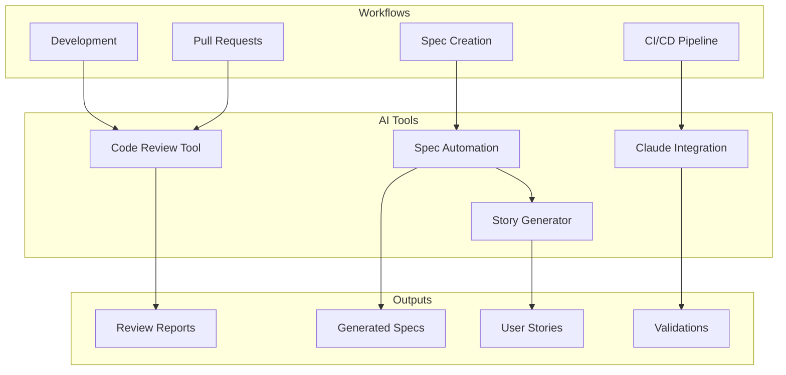
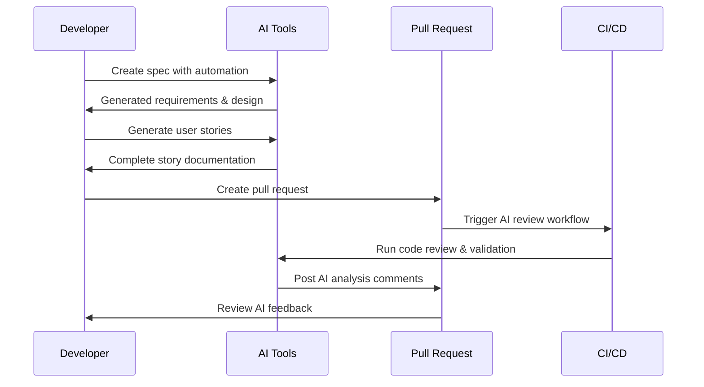

# AI-Powered Development Tools

This document provides a comprehensive overview of the AI-powered development tools integrated into the monorepo for enhanced productivity, code quality, and automation.

## Overview

The AI integration provides several key capabilities:

- **Automated Code Review** - AI-assisted code quality analysis
- **Spec-Driven Development** - AI-powered requirements and design automation
- **Claude Code Integration** - Collaborative AI development workflows
- **User Story Generation** - Automated story and acceptance criteria creation
- **Continuous Validation** - Ongoing spec-to-implementation validation

## AI Tools Architecture



## Tool Overview

| Tool                      | Purpose                 | Automation Step               | Input               | Output        |
| ------------------------- | ----------------------- | ----------------------------- | ------------------- | ------------- |
| **code-review.js**        | AI-assisted code review | PR Analysis                   | Changed files       | Review report |
| **spec-automation.js**    | Spec-driven development | Requirements → Design → Tasks | Feature description | Complete spec |
| **claude-integration.js** | Claude Code workflows   | Validation & Review           | Specs & code        | AI analysis   |
| **story-generator.js**    | User story creation     | Story Generation              | Feature description | User stories  |
| **ai-review.yml**         | CI/CD integration       | Automated review              | PR changes          | AI feedback   |

## Detailed Tool Documentation

### 1. AI Code Review Tool (`tools/ai/code-review.js`)

**Purpose:** Automated code quality analysis and review suggestions

**Key Features:**

- Code complexity analysis
- Security vulnerability detection
- Performance optimization suggestions
- Test coverage validation
- Documentation completeness checks

**Usage:**

```bash
# Review changed files
node tools/ai/code-review.js review

# Review specific files
node tools/ai/code-review.js review --files src/utils.ts,src/components/Button.tsx

# Review against specific branch
node tools/ai/code-review.js review --base-branch develop
```

**Automation Steps:**

1. **File Detection** - Identifies changed files in PR/commit
2. **Complexity Analysis** - Calculates cyclomatic complexity
3. **Security Scanning** - Checks for common vulnerabilities
4. **Performance Review** - Identifies optimization opportunities
5. **Test Coverage** - Validates test completeness
6. **Report Generation** - Creates markdown and JSON reports

**Configuration:**

- Maximum complexity threshold: 10
- Line length limit: 100 characters
- Minimum test coverage: 80%
- Security scan sensitivity: Medium

**Output Files:**

- `.ai-reviews/code-review-{timestamp}.json` - Detailed analysis
- `.ai-reviews/code-review-{timestamp}.md` - Human-readable report

### 2. Spec Automation Tool (`tools/ai/spec-automation.js`)

**Purpose:** Automated spec-driven development workflow

**Key Features:**

- Requirements document generation
- Technical design creation
- Implementation task breakdown
- Spec validation against implementation
- User story integration

**Usage:**

```bash
# Create new spec
node tools/ai/spec-automation.js create user-auth "User authentication system"

# Validate existing spec
node tools/ai/spec-automation.js validate user-auth
```

**Automation Steps:**

1. **Requirements Generation** - Creates user stories and acceptance criteria
2. **Design Creation** - Generates technical architecture and components
3. **Task Breakdown** - Creates atomic implementation tasks
4. **Validation** - Compares implementation against specs
5. **Reporting** - Provides compliance scoring and recommendations

**Generated Documents:**

- `requirements.md` - User stories and acceptance criteria
- `design.md` - Technical architecture and design
- `tasks.md` - Implementation task breakdown
- `validation-report.json` - Compliance analysis

### 3. Claude Code Integration (`tools/ai/claude-integration.js`)

**Purpose:** Integration with Claude Code for collaborative AI development

**Key Features:**

- Spec validation workflows
- Requirements analysis
- Design review
- Implementation guidance
- CI/CD integration

**Usage:**

```bash
# Run code review workflow
node tools/ai/claude-integration.js review spec-name --files file1,file2

# Validate spec implementation
node tools/ai/claude-integration.js validate spec-name

# Analyze requirements quality
node tools/ai/claude-integration.js analyze-requirements spec-name

# Review technical design
node tools/ai/claude-integration.js review-design spec-name
```

**Automation Steps:**

1. **Context Gathering** - Collects relevant specs and implementation files
2. **AI Workflow Execution** - Runs specified Claude Code workflow
3. **Analysis Generation** - Produces structured feedback and recommendations
4. **Result Storage** - Saves analysis for review and tracking
5. **CI Integration** - Provides automated feedback in PR comments

**Supported Workflows:**

- **specValidation** - Validate implementation against specs
- **codeReview** - AI-assisted code review
- **requirementsAnalysis** - Requirements quality analysis
- **designReview** - Technical design validation

### 4. User Story Generator (`tools/ai/story-generator.js`)

**Purpose:** Automated user story and acceptance criteria generation

**Key Features:**

- User persona development
- Epic breakdown
- Detailed story creation
- Acceptance criteria generation
- Story mapping

**Usage:**

```bash
# Generate user stories
node tools/ai/story-generator.js generate feature-name "Feature description"
```

**Automation Steps:**

1. **Persona Generation** - Creates user personas based on feature context
2. **Epic Breakdown** - Organizes functionality into logical epics
3. **Story Creation** - Generates detailed user stories with acceptance criteria
4. **Story Mapping** - Creates user journey and release planning
5. **Documentation** - Produces comprehensive story documentation

**Generated Content:**

- User personas with goals and pain points
- Epic structure with business value
- Detailed user stories with acceptance criteria
- Story map with release planning
- Implementation tasks and test cases

### 5. CI/CD Integration (`.github/workflows/ai-review.yml`)

**Purpose:** Automated AI-powered review in CI/CD pipeline

**Key Features:**

- Automatic change detection
- Parallel AI analysis
- PR comment generation
- Artifact storage
- Status reporting

**Automation Steps:**

1. **Change Detection** - Identifies modified files and affected specs
2. **AI Analysis** - Runs relevant AI tools based on changes
3. **Parallel Execution** - Processes multiple specs simultaneously
4. **Result Aggregation** - Combines analysis from all tools
5. **PR Integration** - Comments with AI feedback and recommendations
6. **Artifact Storage** - Saves detailed analysis for review

**Triggered Workflows:**

- **Code Review** - For code changes
- **Spec Validation** - For specification changes
- **Requirements Analysis** - For requirements updates
- **Design Review** - For design document changes

## Integration Points

### Development Workflow Integration



### Command Integration

**Package.json Scripts:**

```json
{
  "scripts": {
    "ai:review": "node tools/ai/code-review.js review",
    "ai:spec-create": "node tools/ai/spec-automation.js create",
    "ai:spec-validate": "node tools/ai/spec-automation.js validate",
    "ai:stories": "node tools/ai/story-generator.js generate",
    "ai:claude-review": "node tools/ai/claude-integration.js review"
  }
}
```

**Git Hooks Integration:**

```bash
# Pre-commit hook
#!/bin/sh
node tools/ai/code-review.js review --skip-ai

# Pre-push hook
#!/bin/sh
node tools/ai/claude-integration.js validate $(git branch --show-current)
```

## Configuration

### Environment Variables

```bash
# AI tool configuration
AI_REVIEW_ENABLED=true
AI_REVIEW_THRESHOLD=medium
CLAUDE_API_ENABLED=false  # Set to true when API available
STORY_GENERATION_ENABLED=true

# Output directories
AI_REVIEWS_DIR=.ai-reviews
AI_STORIES_DIR=.ai-stories
CLAUDE_RESULTS_DIR=tools/ai/.claude-results
```

### Tool Configuration Files

**AI Review Configuration (`.ai-review-config.json`):**

```json
{
  "complexity": {
    "maxComplexity": 10,
    "maxLineLength": 100
  },
  "security": {
    "level": "medium",
    "failOnHigh": true
  },
  "coverage": {
    "minThreshold": 80,
    "requireTests": true
  }
}
```

## Best Practices

### Using AI Tools Effectively

1. **Start with Specs** - Use spec automation early in feature development
2. **Iterative Refinement** - Use AI feedback to improve code quality
3. **Human Review** - Always review AI suggestions before implementing
4. **Context Awareness** - Provide clear feature descriptions for better AI output
5. **Continuous Validation** - Run spec validation regularly during development

### Integration Guidelines

1. **CI/CD Integration**
   - Run AI reviews on all pull requests
   - Use AI feedback as advisory, not blocking
   - Store AI analysis artifacts for future reference

2. **Development Process**
   - Create specs before implementation
   - Generate user stories early in planning
   - Use AI code review during development
   - Validate specs against implementation regularly

3. **Quality Assurance**
   - Combine AI analysis with human review
   - Use AI suggestions to improve test coverage
   - Validate security recommendations
   - Monitor AI tool effectiveness over time

## Troubleshooting

### Common Issues

#### AI Tools Not Running

```bash
# Check tool permissions
chmod +x tools/ai/*.js

# Verify Node.js version
node --version  # Should be 20+

# Install dependencies
pnpm install
```

#### Missing Output Files

```bash
# Check output directories exist
mkdir -p .ai-reviews .ai-stories tools/ai/.claude-results

# Verify write permissions
ls -la .ai-reviews/
```

#### CI/CD Integration Issues

```bash
# Check workflow file syntax
yq eval '.jobs' .github/workflows/ai-review.yml

# Verify environment variables
echo $AI_REVIEW_ENABLED
```

### Performance Optimization

1. **File Filtering** - Only analyze relevant file types
2. **Parallel Processing** - Run multiple AI tools simultaneously
3. **Caching** - Cache AI analysis results for unchanged files
4. **Selective Analysis** - Only run full analysis on significant changes

## Future Enhancements

### Planned Features

1. **Enhanced Claude Integration** - Direct API integration when available
2. **Machine Learning** - Learn from feedback to improve suggestions
3. **Custom Rules** - Project-specific analysis rules and patterns
4. **Visual Reports** - Interactive dashboards for AI analysis
5. **Team Analytics** - Track AI tool usage and effectiveness

### Integration Opportunities

1. **IDE Integration** - VS Code extension for real-time AI feedback
2. **Slack/Teams** - AI notifications in team channels
3. **Jira Integration** - Automatic story creation in project management
4. **Monitoring** - AI-powered code quality metrics

## Metrics and Analytics

### AI Tool Effectiveness

- **Code Quality Improvement** - Measure complexity reduction over time
- **Bug Reduction** - Track issues found by AI vs. production bugs
- **Development Speed** - Time saved through AI assistance
- **Developer Satisfaction** - Team feedback on AI tool usefulness

### Usage Statistics

- **Tool Usage Frequency** - How often each AI tool is used
- **Feature Adoption** - Which AI features are most valuable
- **Error Rates** - AI tool reliability and accuracy
- **Performance Metrics** - Tool execution time and resource usage

---

_This documentation is automatically updated as AI tools evolve and new features are added._
