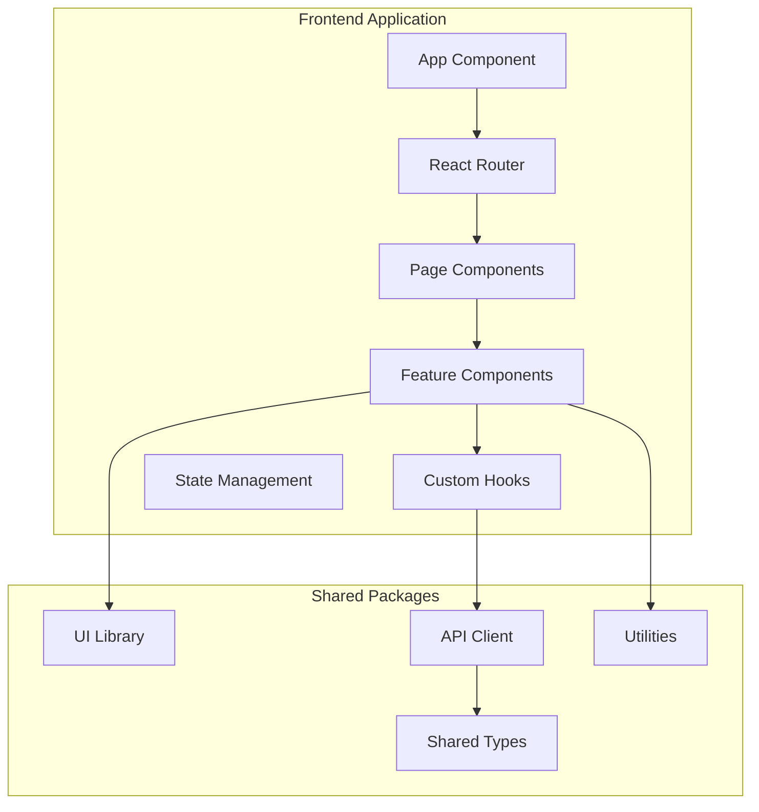
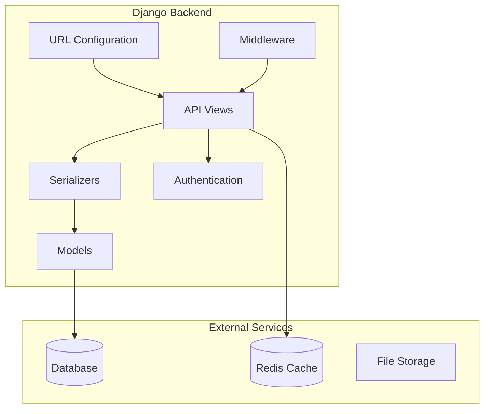
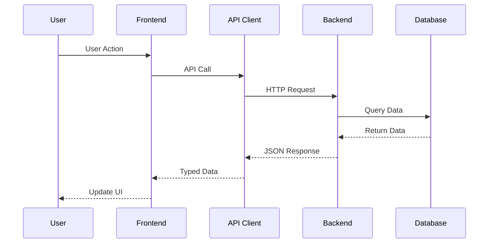
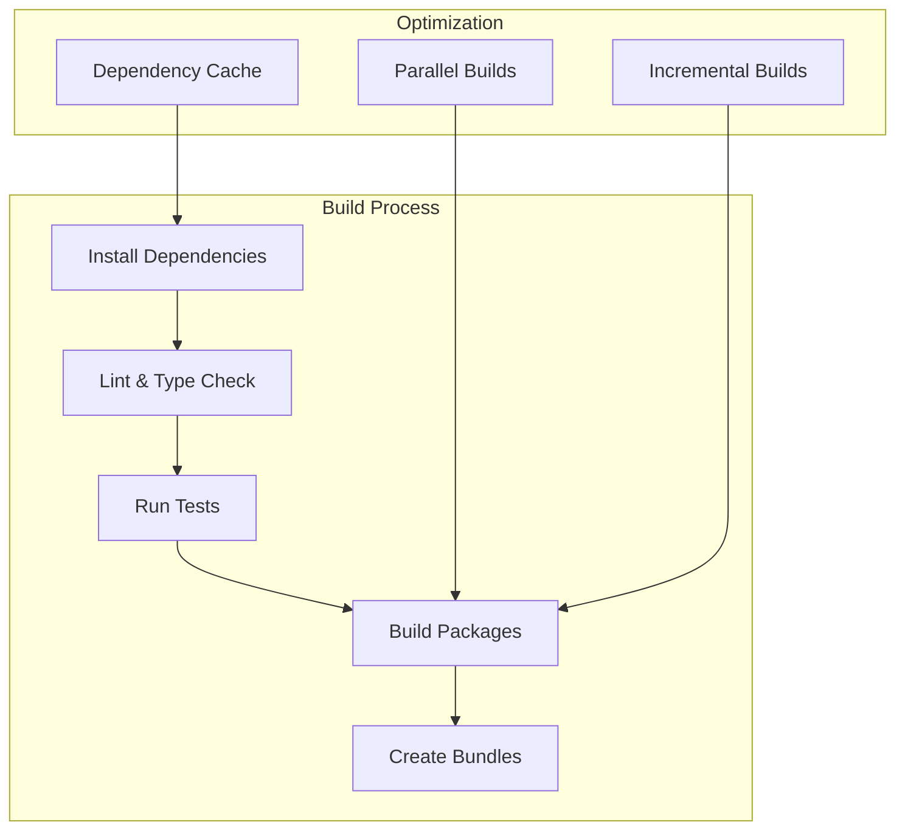
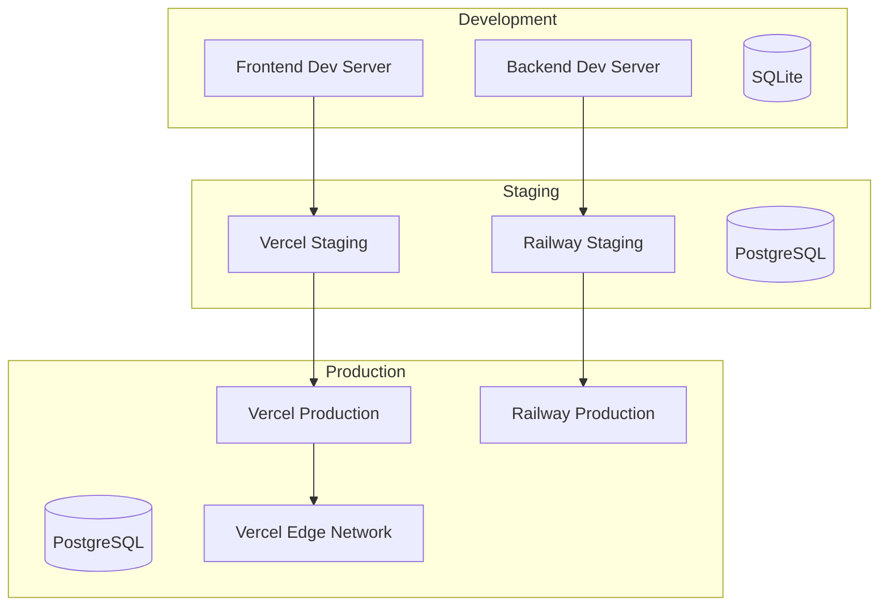
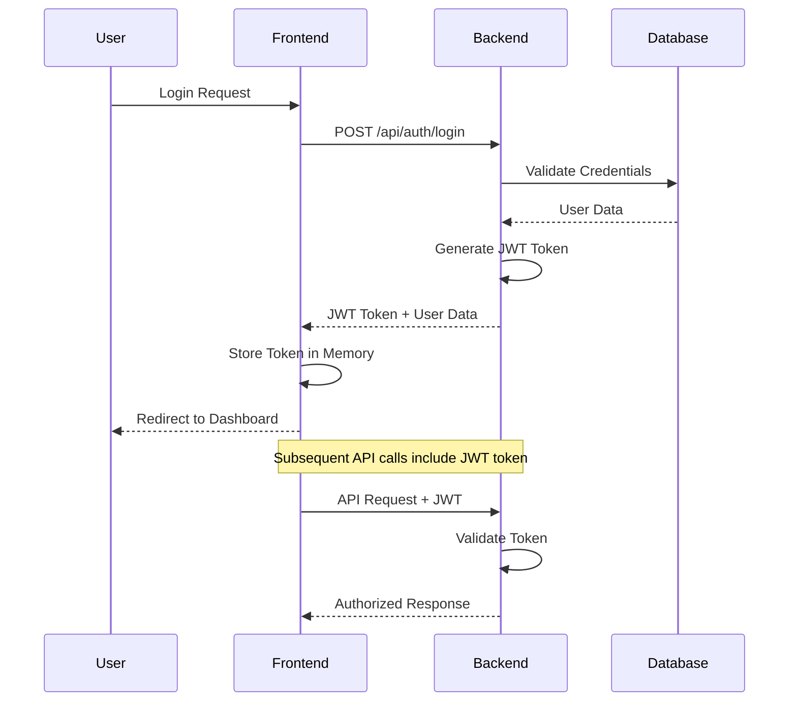
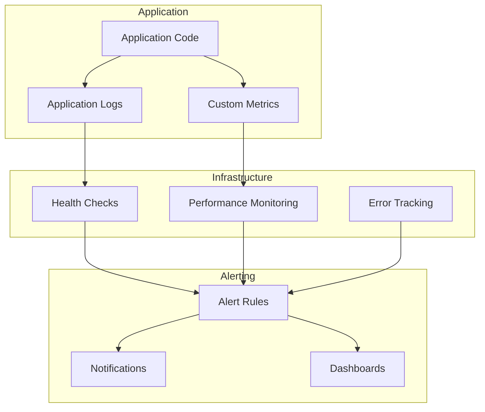
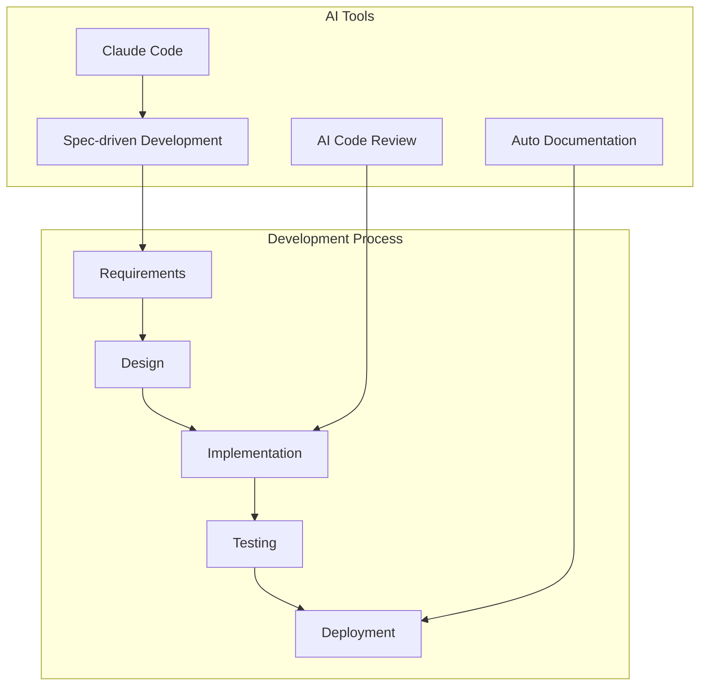

# Architecture Documentation

This document provides a comprehensive overview of the AI-First Modular Monorepo architecture, design decisions, and system components.

## System Overview

The monorepo is designed as a scalable, modular system that supports rapid prototyping while maintaining production-ready quality. It follows modern software engineering practices with AI-first workflows.

```mermaid
graph TB
    subgraph "Monorepo Root"
        subgraph "Applications"
            FE[🎨 Frontend<br/>React + Vite]
            BE[🔧 Backend<br/>Django + DRF]
            WEB[🌐 Web<br/>Next.js (future)]
        end

        subgraph "Shared Packages"
            SHARED[📦 Shared<br/>Types & Utils]
            UI[🎯 UI<br/>Component Library]
            API[🔌 API<br/>Client Library]
        end

        subgraph "Infrastructure"
            INFRA[☁️ Infrastructure<br/>Docker & Deploy]
            TOOLS[🛠️ Tools<br/>Build Scripts]
        end

        subgraph "Configuration"
            ROOT[🏠 Root<br/>Workspace Config]
            CONFIGS[⚙️ Configs<br/>Shared Configs]
        end
    end

    FE --> SHARED
    FE --> UI
    FE --> API
    BE --> SHARED
    WEB --> SHARED
    WEB --> UI
    WEB --> API
    API --> SHARED
    UI --> SHARED
```

## Architecture Principles

### 1. Modularity

- **Clear boundaries** between packages and applications
- **Shared dependencies** managed at the workspace level
- **Independent deployment** of applications and packages
- **Reusable components** across different applications

### 2. Scalability

- **Horizontal scaling** through package addition
- **Workspace-based organization** for growing teams
- **Build optimization** with selective package building
- **Caching strategies** for improved performance

### 3. Developer Experience

- **Unified tooling** across all packages
- **Consistent code style** and quality standards
- **Hot reload** and fast development cycles
- **AI-assisted development** workflows

### 4. Quality Assurance

- **Automated testing** at multiple levels
- **Type safety** with TypeScript throughout
- **Continuous integration** with comprehensive checks
- **Code review** processes and automation

## Directory Structure

```
.
├── apps/                       # Applications
│   ├── frontend/               # React + Vite application
│   │   ├── src/
│   │   ├── public/
│   │   ├── package.json
│   │   ├── vite.config.js
│   │   └── tsconfig.json
│   └── backend/                # Django REST API
│       ├── backend/            # Django project
│       ├── apps/               # Django apps
│       ├── manage.py
│       ├── requirements.txt
│       └── package.json
│
├── packages/                   # Shared packages
│   ├── shared/                 # Common types and utilities
│   │   ├── src/
│   │   │   ├── types/
│   │   │   ├── utils/
│   │   │   └── constants/
│   │   ├── package.json
│   │   └── tsconfig.json
│   ├── ui/                     # React component library
│   │   ├── src/
│   │   │   ├── components/
│   │   │   ├── hooks/
│   │   │   └── styles/
│   │   ├── package.json
│   │   └── tsconfig.json
│   └── api/                    # API client library
│       ├── src/
│       │   ├── client/
│       │   ├── types/
│       │   └── utils/
│       ├── package.json
│       └── tsconfig.json
│
├── configs/                    # Shared configurations
│   ├── eslint/
│   │   ├── base.js
│   │   ├── react.js
│   │   └── node.js
│   ├── typescript/
│   │   ├── base.json
│   │   ├── react.json
│   │   └── library.json
│   └── prettier/
│       └── base.json
│
├── tools/                      # Build tools and utilities
│   ├── build/
│   └── dev/
│
├── infra/                      # Infrastructure
│   ├── docker/
│   └── deploy/
│
├── docs/                       # Documentation
│   ├── setup.md
│   ├── contributing.md
│   ├── deployment.md
│   ├── architecture.md
│   └── api/
│
├── .github/                    # CI/CD workflows
│   └── workflows/
│       ├── ci.yml
│       ├── deploy.yml
│       └── release.yml
│
├── .vscode/                    # VS Code configuration
│   ├── settings.json
│   ├── extensions.json
│   └── launch.json
│
├── package.json                # Root workspace configuration
├── pnpm-workspace.yaml         # pnpm workspace definition
├── tsconfig.json               # Root TypeScript configuration
└── README.md                   # Project overview
```

## Component Architecture

### Frontend Application (React + Vite)



**Key Features:**

- **Vite** for fast development and building
- **React Router** for client-side routing
- **TypeScript** for type safety
- **Tailwind CSS** for styling
- **React Query** for data fetching
- **Zustand** for state management

### Backend Application (Django + DRF)



**Key Features:**

- **Django REST Framework** for API development
- **PostgreSQL** for primary database
- **Redis** for caching and sessions
- **JWT Authentication** for API security
- **Celery** for background tasks
- **Django Admin** for content management

### Shared Packages

#### @monorepo/shared

```typescript
// Types
export interface ApiResponse<T> {
  data: T;
  message?: string;
  error?: string;
}

export interface User {
  id: string;
  email: string;
  name: string;
  createdAt: string;
}

// Utilities
export const validateEmail = (email: string): boolean => {
  return /^[^\s@]+@[^\s@]+\.[^\s@]+$/.test(email);
};

// Constants
export const API_ENDPOINTS = {
  AUTH: '/api/auth',
  USERS: '/api/users',
} as const;
```

#### @monorepo/ui

```typescript
// Component Library
export interface ButtonProps {
  variant?: 'primary' | 'secondary' | 'danger';
  size?: 'sm' | 'md' | 'lg';
  disabled?: boolean;
  children: React.ReactNode;
  onClick?: () => void;
}

export const Button: React.FC<ButtonProps> = ({
  variant = 'primary',
  size = 'md',
  disabled = false,
  children,
  onClick
}) => {
  const baseClasses = 'px-4 py-2 rounded font-medium transition-colors';
  const variantClasses = {
    primary: 'bg-blue-600 text-white hover:bg-blue-700',
    secondary: 'bg-gray-200 text-gray-900 hover:bg-gray-300',
    danger: 'bg-red-600 text-white hover:bg-red-700'
  };
  const sizeClasses = {
    sm: 'text-sm px-2 py-1',
    md: 'text-base px-4 py-2',
    lg: 'text-lg px-6 py-3'
  };

  return (
    <button
      className={`${baseClasses} ${variantClasses[variant]} ${sizeClasses[size]}`}
      disabled={disabled}
      onClick={onClick}
    >
      {children}
    </button>
  );
};
```

#### @monorepo/api

```typescript
// API Client
import { ApiResponse } from '@monorepo/shared';

export class ApiClient {
  private baseUrl: string;
  private token?: string;

  constructor(baseUrl: string) {
    this.baseUrl = baseUrl;
  }

  setToken(token: string) {
    this.token = token;
  }

  async get<T>(endpoint: string): Promise<ApiResponse<T>> {
    const response = await fetch(`${this.baseUrl}${endpoint}`, {
      headers: {
        'Content-Type': 'application/json',
        ...(this.token && { Authorization: `Bearer ${this.token}` }),
      },
    });

    if (!response.ok) {
      throw new Error(`HTTP error! status: ${response.status}`);
    }

    return response.json();
  }

  async post<T>(endpoint: string, data: any): Promise<ApiResponse<T>> {
    const response = await fetch(`${this.baseUrl}${endpoint}`, {
      method: 'POST',
      headers: {
        'Content-Type': 'application/json',
        ...(this.token && { Authorization: `Bearer ${this.token}` }),
      },
      body: JSON.stringify(data),
    });

    if (!response.ok) {
      throw new Error(`HTTP error! status: ${response.status}`);
    }

    return response.json();
  }
}
```

## Data Flow Architecture



### Request/Response Flow

1. **User Interaction** - User interacts with React components
2. **State Management** - Action triggers state update or API call
3. **API Client** - Typed API client handles HTTP communication
4. **Backend Processing** - Django views process requests
5. **Database Operations** - Models interact with PostgreSQL
6. **Response Serialization** - DRF serializers format responses
7. **Frontend Update** - React components re-render with new data

## Build System Architecture



### Build Pipeline

1. **Dependency Installation** - pnpm installs and hoists dependencies
2. **Quality Checks** - ESLint, TypeScript, and Prettier validation
3. **Testing** - Unit, integration, and E2E tests
4. **Package Building** - TypeScript compilation and bundling
5. **Artifact Creation** - Production-ready bundles

### Build Optimization

- **Dependency Hoisting** - Shared dependencies at workspace root
- **Parallel Execution** - Multiple packages built simultaneously
- **Incremental Builds** - Only changed packages rebuilt
- **Caching Strategy** - Build artifacts cached for reuse
- **Tree Shaking** - Dead code elimination

## Deployment Architecture



### Environment Strategy

- **Development** - Local development with hot reload
- **Staging** - Production-like environment for testing
- **Production** - High-availability deployment with CDN

## Security Architecture

### Authentication Flow



### Security Measures

- **JWT Authentication** - Stateless token-based auth
- **HTTPS Everywhere** - All communications encrypted
- **CORS Configuration** - Restricted cross-origin requests
- **Input Validation** - All inputs sanitized and validated
- **SQL Injection Protection** - Django ORM prevents injection
- **XSS Protection** - Content Security Policy headers
- **Secret Management** - Environment variables for secrets

## Performance Architecture

### Frontend Performance

- **Code Splitting** - Lazy loading of route components
- **Bundle Optimization** - Tree shaking and minification
- **Caching Strategy** - Browser caching with cache busting
- **CDN Delivery** - Static assets served from edge locations
- **Image Optimization** - WebP format with lazy loading

### Backend Performance

- **Database Indexing** - Optimized queries with proper indexes
- **Connection Pooling** - Efficient database connections
- **Caching Layer** - Redis for frequently accessed data
- **Query Optimization** - Django ORM query optimization
- **Background Tasks** - Celery for async processing

### Monitoring and Observability



## AI Integration Architecture

### AI-First Development Workflow



### AI-Powered Features

- **Spec-driven Development** - AI-assisted requirements and design
- **Code Generation** - Automated boilerplate and component creation
- **Code Review** - AI-powered code quality analysis
- **Documentation** - Auto-generated API docs and guides
- **Testing** - AI-assisted test case generation
- **Optimization** - Performance and security recommendations

## Scalability Considerations

### Horizontal Scaling

- **Package Addition** - Easy addition of new packages
- **Service Separation** - Independent scaling of services
- **Team Scaling** - Clear ownership boundaries
- **Build Scaling** - Distributed build execution

### Performance Scaling

- **Database Scaling** - Read replicas and connection pooling
- **Caching Strategy** - Multi-layer caching architecture
- **CDN Usage** - Global content delivery
- **Load Balancing** - Distributed traffic handling

## Decision Records

### ADR-001: Monorepo Structure

**Status**: Accepted

**Context**: Need to manage multiple related applications and packages efficiently.

**Decision**: Use pnpm workspaces for monorepo management.

**Consequences**:

- Improved code sharing and consistency
- Simplified dependency management
- Better development experience
- Increased build complexity

### ADR-002: Frontend Technology Stack

**Status**: Accepted

**Context**: Need modern, performant frontend development.

**Decision**: React + Vite + TypeScript + Tailwind CSS

**Consequences**:

- Fast development and build times
- Type safety throughout application
- Modern development experience
- Learning curve for team members

### ADR-003: Backend Technology Stack

**Status**: Accepted

**Context**: Need robust, scalable API development.

**Decision**: Django + Django REST Framework + PostgreSQL

**Consequences**:

- Rapid API development
- Built-in admin interface
- Strong ecosystem and community
- Python-specific knowledge required

### ADR-004: Package Management

**Status**: Accepted

**Context**: Need efficient dependency management for monorepo.

**Decision**: Use pnpm for package management

**Consequences**:

- Faster installs and less disk usage
- Better workspace support
- Stricter dependency resolution
- Tool-specific knowledge required

## Future Architecture Considerations

### Planned Enhancements

1. **Microservices Migration** - Gradual extraction of services
2. **GraphQL API** - Unified data layer with GraphQL
3. **Mobile Applications** - React Native or Flutter apps
4. **Machine Learning** - AI/ML model integration
5. **Real-time Features** - WebSocket and SSE support
6. **Edge Computing** - Edge functions for performance

### Technology Evolution

- **Framework Updates** - Regular updates to latest versions
- **New Technologies** - Evaluation and integration of emerging tech
- **Performance Optimization** - Continuous performance improvements
- **Security Enhancements** - Regular security updates and audits

This architecture provides a solid foundation for scalable, maintainable, and performant applications while supporting rapid development and AI-first workflows.
